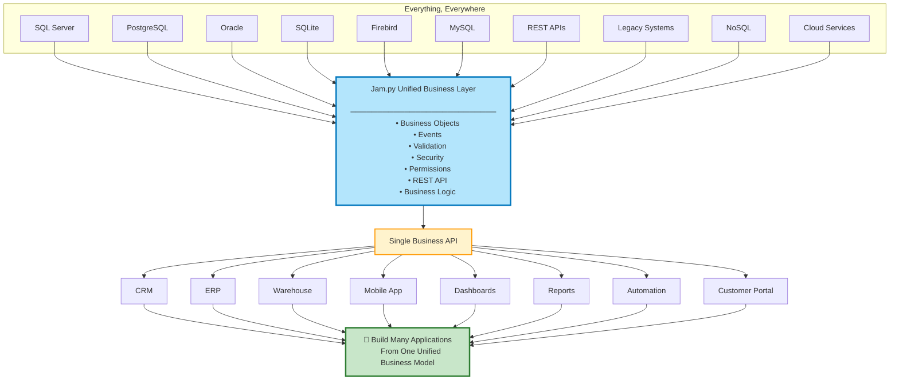

# msaccess2web

## Access Microsoft Access data on the Web.

No database migration required. No code needed.

Web application created with **a single command in 1 second**:

scaffold.py --db **C:\Users\Downloads\access_database.accdb**



# How to run?

Download this repository. If no MS Access is not installed, you'll need [Microsoft Access 2016 Runtime](https://www.microsoft.com/en-us/download/details.aspx?id=50040).

Open Windows "Command Prompt". Navigate to downloaded or unzipped folder. Run as above IF you have Python installed, plus "pip install pyodbc textblob sqlparse":

scaffold_msaccess.py --db **C:\Users\Downloads\access_database.accdb**


If Python is not installed, download scaffold_msaccess.exe from Releases on the right hand side, and run:

scaffold_msaccess.exe --db **C:\Users\Downloads\access_database.accdb**


scaffold_msaccess.exe is packaged application by Github actions with Python and above pyodbc textblob sqlparse dependencies. It is safe to use.


[](https://raw.githubusercontent.com/platipusica/msaccess2web/refs/heads/main/output.gif)


File size for this example:
```
C:\Users\dba\Downloads>dir access_database.accdb
 Volume in drive C has no label.
 Volume Serial Number is FEBB-5BF6

 Directory of C:\Users\dba\Downloads

08/06/2026  06:36 PM         8,388,608 access_database.accdb
               1 File(s)      8,388,608 bytes
               0 Dir(s)  40,732,401,664 bytes free
```

File type:
```
C:\Users\dba\Downloads>type access_database.accdb
Standard ACE DB...
```


## Features

- Works on Windows only
- Preserves Access compatibility


## Commercial support

This project is maintained for enterprise MS Access modernization projects.

Contact if:
- you are stuck on Access
- cannot migrate easily
- fear rewriting everything
- need MS Access data on the Web
